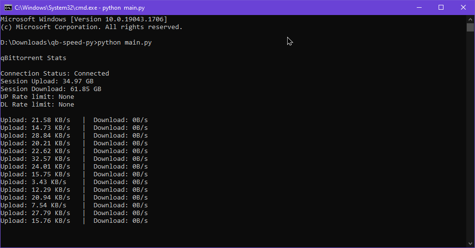

# qb-speed-py
This is a simple script that tells you, your qBittorrent stats using the WebUI and the qbittorrent-api library.

##### Instructions

**Install qbittorrent-api via pip**

`pip install qbittorrent-api`

**Change these settings in main.py**
```python
# Example
qbt_client = qb.Client(
    host="localhost",
    port=1234,
    username="admin",
    password="adminadmin")
```

**Start the script**

`python main.py`
  

